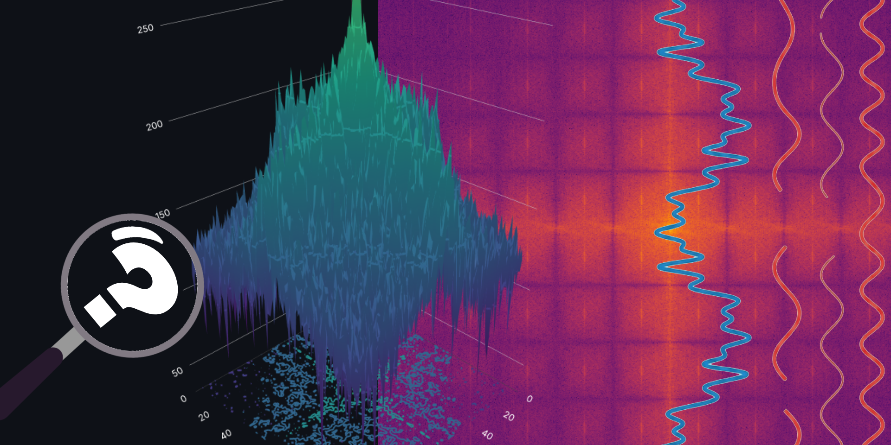

# 🕵️‍♂️ CounterForensics

A toolkit for AI detection evasion and image forensics.



Designed as a companion to my blog post *"[How to Trick AI Detectors](https://alig.dev/blog/how-to-trick-ai-detectors)"*.

[CounterForensics](https://forensics.alig.dev)
> The live version has file size and resolution restrictions. You can run the application locally for unrestricted use.

## Quick Start (Local)

### Prerequisites

* Python 3.10+
* pip

### Installation

1. **Clone the repository**

    ```bash
    git clone https://github.com/AliGaygisiz/CounterForensics.git
    cd CounterForensics
    ```

2. **Install Dependencies**

    ```bash
    pip install -r requirements.txt
    ```

3. **Run the App**

    ```bash
    streamlit run app.py
    ```

    The application will open in your browser at `http://localhost:8501`.

